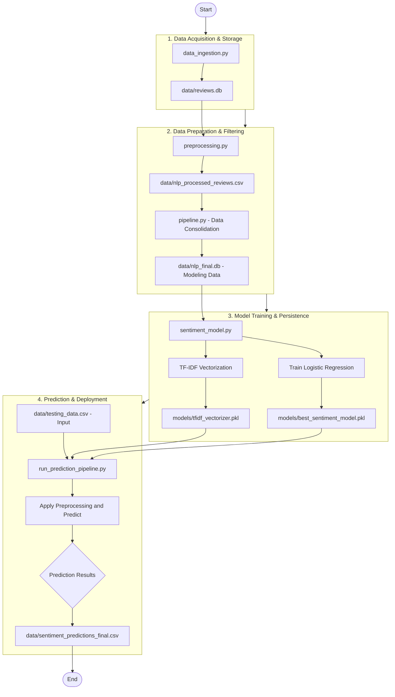

# Sentiment Analysis Pipeline - UML Activity Diagram

```mermaid
flowchart TD
    %% Initial State
    Start([Start]) --> A

    %% A. Data Acquisition & Storage
    subgraph A[1. Data Acquisition & Storage]
        direction TB
        A1[data_ingestion.py] --> A2[data/reviews.db]
    end

    %% B. Data Preparation & Filtering
    subgraph B[2. Data Preparation & Filtering]
        direction TB
        A2 --> B1[preprocessing.py]
        B1 --> B2[data/nlp_processed_reviews.csv]
        B2 --> B3[pipeline.py - Data Consolidation]
        B3 --> B4[data/nlp_final.db - Modeling Data]
    end

    %% C. Model Training & Persistence
    subgraph C[3. Model Training & Persistence]
        direction TB
        B4 --> C1[sentiment_model.py]
        C1 --> C2[TF-IDF Vectorization]
        C1 --> C3[Train Logistic Regression]
        C2 --> C4[models/tfidf_vectorizer.pkl]
        C3 --> C5[models/best_sentiment_model.pkl]
    end

    %% D. Prediction & Deployment
    subgraph D[4. Prediction & Deployment]
        direction TB
        D1[data/testing_data.csv - Input] --> D2[run_prediction_pipeline.py]
        C4 --> D2
        C5 --> D2
        D2 --> D3[Apply Preprocessing and Predict]
        D3 --> D4{Prediction Results}
        D4 --> D5[data/sentiment_predictions_final.csv]
    end

    %% Flow Connections
    A --> B
    B --> C
    C --> D

    %% Final State
    D5 --> EndNode([End])
```